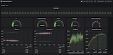
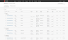

# DSA-110 Software Status

## Web Apps

## Services

Name | Container | etcd key | Repo | command
---- | ------ | ------| ---------- | ----- | ------ | ----
snap | snapserver | /cmd/snap? | [SNAP_control](https://github.com/dsa110/SNAP_control) | 
corr | corr 01-16 | /cmd/corr | [dsa110-xengine](https://github.com/dsa110/dsa110-xengine) | `dsacon corr start/set/stop`
search | corr 17-20 | /cmd/corr | [dsa110-mbheimdall](https://github.com/dsa110/dsa110-mbheimdall), [dsa110-meridian-fs](https://github.com/dsa110/dsa110-meridian-fs) | `dsacon corr start/set/stop`
t2 | corr00 | none | [dsa110-T2](https://github.com/dsa110/dsa110-T2) | `run_T2.py`
preproc, calibration, bfcopy | dsa-storage | /cmd/cal, /mon/cal/bfweights | [preprocess_service.py](https://github.com/dsa110/dsa110-calib/blob/main/services/preprocess_service.py), [calibration_service.py](https://github.com/dsa110/dsa110-calib/blob/main/services/calibration_service.py), beamformerweights.py | ?
voltage | corr 01-16 | /mon/corr/1/trigger | [dsa110-xengine](https://github.com/dsa110/dsa110-xengine) | `look_after_dumps.py`
triggercopy | dsa-storage | ? | ?
send_cands | h23 | datestring? | [send_cands.py](https://github.com/dsa110/dsa110-T3/blob/main/services/send_cands.py) | ?

## Code Tests and Docs

[Issues](https://github.com/dsa110/dsa110-issues)
|
[Calibration](https://dsa110.github.io/dsa110-calib/) 
|
[T2](https://dsa110.github.io/dsa110-T2/) 
|
[antpos](https://github.com/dsa110/dsa110-antpos) 
|
[fringe stopping](https://github.com/dsa110/dsa110-meridian-fs) 

## Repo Links

**Hardware**
|
[DSA antpos](https://github.com/dsa110/dsa110-antpos)
|
[Antenna alignment](https://github.com/dsa110/dsa110-alignment)

**Digital**
|
[SNAP control](https://github.com/dsa110/SNAP_control/tree/v3)
|
[SNAP power](https://github.com/dsa110/dsa110-powersnap)
|
[X engine](https://github.com/dsa110/dsa110-xengine)

**Calibration**
|
[Fringe stopping](https://github.com/dsa110/dsa110-meridian-fs)
|
[Calibration](https://github.com/dsa110/dsa110-calib)
|
[Calibration tools](https://github.com/dsa110/dsa110-caltools)

**Search**
|
[MB Heimdall](https://github.com/dsa110/dsa110-mbheimdall)
|
[T2](https://dsa110.github.io/dsa110-T2/)

**Analysis and Data Management**
|
[Analysis notebooks](https://github.com/dsa110/dsa-notebooks)
|
[bbproc](https://github.com/dsa110/dsa110-bbproc)
|
[procfil](https://github.com/dsa110/dsa110-procfil)
|
[scripts](https://github.com/dsa110/dsa110-xengine/tree/v0.9/scripts) (scripts to be reorganized)

**M&C**
|
[M&C and utilities](https://github.com/dsa110/dsa110-pyutils)
|
[DSA hardware M&C](https://github.com/dsa110/dsa110-hwmc)
|
[Antenna status (bokeh)](https://github.com/dsa110/dsa110-vis)
