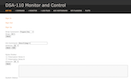
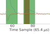
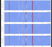
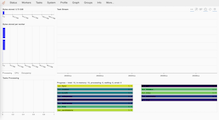

# DSA-110 Software Status

## Web Apps

Name | tunnel/location | link |
---  | ---             | ---  |
WebUI | webserveruiservice:9090 |  |
Grafana | grafanaservice:3000 |  |
Unified dashboard | lxd110h23.pro.pvt:5008 |  | 
Hiplot | lxd110h23.pro.pvt:5007 | [](http://localhost:5007/?hip.load_uri=%22cluster_output.csv%22&hip.filters=%5B%5D&hip.color_by=%22dm%22&hip.PARALLEL_PLOT.order=%5B%22dm%22%2C%22ibox%22%2C%22mjds%22%2C%22snr%22%2C%22ibeam%22%2C%22snrs1%22%2C%22snrs2%22%2C%22beams1%22%2C%22beams2%22%5D&hip.PARALLEL_PLOT.hide=%5B%22snrs4%22%2C%22snrs3%22%2C%22snrs5%22%2C%22snrs6%22%2C%22snrs7%22%2C%22snrs8%22%2C%22snrs9%22%2C%22snrs0%22%2C%22beams4%22%2C%22beams3%22%2C%22beams5%22%2C%22beams6%22%2C%22beams7%22%2C%22beams8%22%2C%22beams9%22%2C%22beams0%22%2C%22cl%22%2C%22cntb%22%2C%22cntc%22%2C%22uid%22%2C%22idm%22%2C%22if%22%2C%22itime%22%2C%22specnum%22%5D&hip.XY.axis_y=%22ibeam%22&hip.XY.axis_x=%22mjds%22&hip.params.ibox.type=%22numeric%22&hip.PARALLEL_PLOT.invert=%5B%5D) |
Burst analysis | lxd110h23.pro.pvt:5009 |  | 
Calibration plots | lxdlwah20.pro.pvt:9090 |  |
NSFRBcal plots | lxdlwah20.pro.pvt:9090 |  |
MAAS | dsa110maas:5240 |  |
Dask | lxd110h23.pro.pvt:8787 |  |
Event Archive | (github) | [DSA-110 Event Archive](http://code.deepsynoptic.org/dsa110-archive) |
RFI plots | (github) | [DSARFI](http://greghell.github.io/DSARFI) |

## Services

Name | Container | etcd key | Repo | command
---- | ------ | ------| ---------- | ----- | ------ | ----
snap | snapserver | /cmd/snap? | [SNAP_control](https://github.com/dsa110/SNAP_control) | 
corr | corr 01-16 | /cmd/corr | [dsa110-xengine](https://github.com/dsa110/dsa110-xengine) | `dsacon corr start/set/stop`
search | corr 17-20 | /cmd/corr | [dsa110-mbheimdall](https://github.com/dsa110/dsa110-mbheimdall), [dsa110-meridian-fs](https://github.com/dsa110/dsa110-meridian-fs) | `dsacon corr start/set/stop`
t2 | corr00 | none | [dsa110-T2](https://github.com/dsa110/dsa110-T2) | `run_T2.py`
preproc, calibration, bfcopy | dsa-storage | /cmd/cal, /mon/cal/bfweights | [preprocess_service.py](https://github.com/dsa110/dsa110-calib/blob/main/services/preprocess_service.py), [calibration_service.py](https://github.com/dsa110/dsa110-calib/blob/main/services/calibration_service.py), beamformerweights.py | ?
voltage | corr 01-16 | /mon/corr/1/trigger | [dsa110-xengine](https://github.com/dsa110/dsa110-xengine) | `look_after_dumps.py`
tasktrigger, send_cands | h23 | `/cmd/corr/docopy`, `/cmd/datestring` | [tasktrigger.py](https://github.com/dsa110/dsa110-T3/blob/main/services/tasktrigger.py) | `systemctl --user start send_cands`
declination | h23 | /mon/array/<dec, pointing_J2000, gal_dm, gal_rm> | [dsa110-pyutils](https://github.com/dsa110/dsa110-pyutils/blob/ds/dev/services/update_declination.py) | `systemctl --user start declination`

## Operations and Docs
|
[Observer on duty procedure](https://caltech.sharepoint.com/sites/ovro/projects/_layouts/15/guestaccess.aspx?guestaccesstoken=57nyO0SQ5zF9ZAPSCFxi7YYLCvFydqOI8RpTHwFkUWU%3D&docid=2_0c25a024999414027bf66c42cb1d77ead&rev=1&e=uVcc9v)
|
[Issues](https://github.com/dsa110/dsa110-issues)
|
[myrepos](https://github.com/dsa110/dsa110-shell)
|
[configuration](https://github.com/dsa110/dsa110-cnf)
|
[scheduling](https://github.com/dsa110/dsa110-controlscripts)
|
[systemd services](https://github.com/dsa110/dsa110-systemd)

## Repo Links

**Hardware**
|
[DSA antpos](https://github.com/dsa110/dsa110-antpos)
|
[Antenna alignment](https://github.com/dsa110/dsa110-alignment)

**Digital**
|
[SNAP control](https://github.com/dsa110/SNAP_control/tree/v3)
|
[SNAP power](https://github.com/dsa110/dsa110-powersnap)
|
[X engine](https://github.com/dsa110/dsa110-xengine)

**Calibration**
|
[Fringe stopping](https://github.com/dsa110/dsa110-meridian-fs)
|
[Calibration](https://github.com/dsa110/dsa110-calib)
|
[Calibration tools](https://github.com/dsa110/dsa110-caltools)

**Search**
|
[MB Heimdall](https://github.com/dsa110/dsa110-mbheimdall)
|
[T2](https://dsa110.github.io/dsa110-T2/)

**Analysis and Data Management**
|
[T3](https://github.com/dsa110/dsa110-T3)
|
[Events and alerts](https://github.com/dsa110/dsa110-event)
|
[bbproc](https://github.com/dsa110/dsa110-bbproc)
|
[procfil](https://github.com/dsa110/dsa110-procfil)
|
[scripts](https://github.com/dsa110/dsa110-xengine/tree/v0.9/scripts) (scripts to be reorganized)

**M&C**
|
[M&C and utilities](https://github.com/dsa110/dsa110-pyutils)
|
[DSA hardware M&C](https://github.com/dsa110/dsa110-hwmc)
|
[Dashboard and visualization](https://github.com/dsa110/dsa110-vis)
